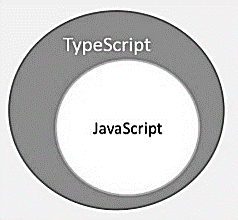
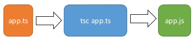

## Typescript

### Overview

- TypeScript is a typed super set of JavaScript that compiles to plain JavaScript.

  

- TypeScript is pure object oriented with classes, interfaces and statically typed like C# or Java.
- Compiled TypeScript can be consumed from any JavaScript code.
- Typescript provides [playground](https://www.typescriptlang.org/play/) to run and test. The online editor shows the corresponding JavaScript emitted by the compiler.
- Typescript compiler rejects any raw JavaScript file passed to it. The compiler deals with only **.ts** or **.d.ts** files.

---

### Architecture

- It was designed by **Anders Hejlsberg** (designer of C#) at Microsoft.
- TypeScript comes with an optional static typing and type inference system through the TLS (TypeScript Language Service).
- Typescript uses features like Modules, classes inline to EcmaScript specifications. Typescript also adds additional features like generics and type annotations that aren’t a part of the EcmaScript.
- JavaScript is an interpreted language. Identification of errors can be done based on code execution. Unlike JavaScript, Typescript transpiler provides the error-checking feature. TypeScript will compile the code and generate compilation errors, if it finds some sort of syntax errors.
- TypeScript supports type definitions for existing JavaScript libraries. TypeScript Definition file (with **.d.ts** extension) provides definition for external JavaScript libraries.

---

### Installation

- Install Node.js from [here](https://nodejs.org)
- Install typescript using `npm i -g typescript`. During this tutorial typescript version was **v3.6**.
- To convert a file from **.ts** to **.js** run `tsc <file.ts>`
  
- Typescript has good support for VSCode.

---

### Modules

-

---
