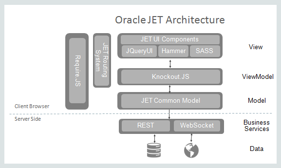
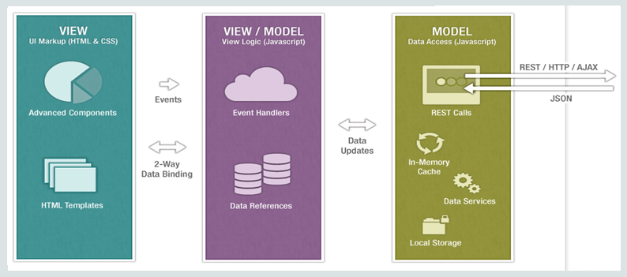
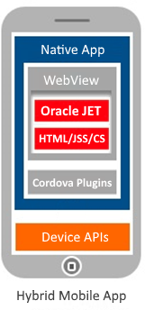

# Oracle JET

## Table of Content

- [Overview](#Overview)
- [Installation](#Installation)
- [Modules](#Modules)
- [Appendix](#Appendix)

## Overview

- Oracle JET is a collection of Oracle and open source JavaScript libraries engineered to make it as simple and efficient as possible to build client-side web and hybrid mobile applications based on JavaScript, HTML5, and CSS.
- The key feature of Oracle JET Toolkit are given below:
  - Messaging and Event services for both Model and View layers.
  - Validation framework that provides UI element and component validation and data converters
  - Caching services at the Model layer for performance optimization of pagination and virtual scrolling
  - Filtering and sorting services provided at the Model layer
  - Connection to data sources through Web services, such as Representational State Transfer (REST) or WebSocket
  - Management of URL and browser history using Oracle JET oj.Router and oj-module components
  - Integrated authorization through OAuth 2.0 for data models retrieved from REST Services
  - Resource management provided by RequireJS
  - API compatibility with Backbone.js Model, Collection, and Events classes, except for Backbone.js Underscore methods.
  - JavaScript logging
  - Popup UI handling
  - Compliance with Oracle National Language Support (NLS) standards (i18n) for numeric, currency, and date/time formatting
  - Built-in theming supporting the Oracle Alta UI style specifications
  - Responsive layout framework
  - Gesture functionality by touch, mouse, and pointer events where appropriate
  - Web Content Accessibility Guidelines (WCAG) 2.0
  - Support for Oracle software localization standards, l10n

---

## Architecture

- Oracle JET is not a Javascript framework but it is a Toolkit of Open Source Web Frameworks and oracle glue code to use these frameworks.

  

- Oracle JET is used to display data into Single Page Web Applications but getting data using REST or WebSockets.
- Oracle JET supports the Model-View-ViewModel (MVVM) architectural design pattern.

  - **Model**: Used to represent the application data
  - **View**: Used for presentation of Data
  - **ViewModel**: Exposes data from the Model to the view and maintains the application's state.

    

- Oracle JET uses cordova plugin to render HTML WebPages into IOS and Android devices using native WebViewer.

  

---

## Installation

- Jet installation

  - Installing Node.js

    ```sh
    # Configuring Proxy
    export http_proxy="http://<ip>:<port>"
    export https_proxy="http://<ip>:<port>"
    # Install Node.js
    wget https://yum.oracle.com/repo/OracleLinux/OL7/developer_nodejs10/x86_64/getPackage/nodejs-10.16.3-1.0.1.el7.x86_64.rpm
    sudo rpm -ivh nodejs-10.16.3-1.0.1.el7.x86_64.rpm
    # Set Proxy
    npm config set proxy http://<ip>:<port>
    npm config set https-proxy http://<ip>:<port>
    # Delete Proxy
    npm config rm proxy
    npm config rm https-proxy
    ```

  - Installing Oracle Jet

    ```sh
    # Changing Node Global
    sudo su
    mkdir /scratch/jet/.npm-global
    npm config set prefix '/scratch/jet/.npm-global'
    vi ~/.bash_profile
      # Add below to path
      export PATH=/scratch/jet/.npm-global/bin:$PATH

    source ~/.bash_profile

    # Install Oracle Jet CLI and associated libraries
    # For specific version use npm install -g @oracle/ojet-cli@~6.0.0
    npm install -g @oracle/ojet-cli cordova webpack webpack-cli  typescript

    # Verification of Ojet CLI
    npm list -g ojet-cli
    ojet help
    ojet --version

    # Upgrade JET
    npm cache clean –force
    npm upgrade -g @oracle/ojet-cli

    # Uninstall JET
    npm uninstall -g @oracle/ojet-cli
    ```

  - Creating a WebApp using Oracle Jet - Typescript and Webpack

    ```sh
    ojet create --template=navdrawer Demo-01
    cd Demo-01
    # Copy and paste unizp content of  04-Modules\01-Install\jet-webpack.zip
    npm i @types/oracle__oraclejet text-loader requirejs-text
    # Copy 04-Modules\01-Install\tsconfig.json
    webpack
    # Change index.html and update with bundle.js
    ```

---

## Modules

---

## Appendix

- Reference
  - Tutorial
    - [Awesome Oracle JET](https://github.com/JohnRSim/awesome-jet)
